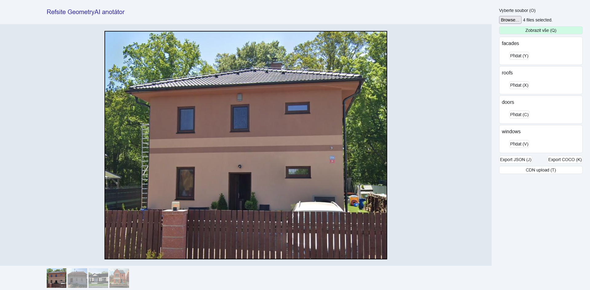

# Uživatelský manuál k anotační aplikaci

Tento manuál vás provede používáním anotační aplikace pro označování objektů na obrázcích pomocí polygonů.

## Obsah

1. Úvod
2. Uživatelské rozhraní
3. Nahrání obrázků
4. Navigace mezi obrázky
5. Typy anotací
6. Vytváření nových anotací
7. Výběr a úprava existujících anotací
8. Smazání anotací
9. Zobrazení všech anotací
10. Export anotací
11. CDN Upload
12. Přehled klávesových zkratek

---

## 1. Úvod

Vítejte v anotační aplikaci **GeometryAI Anotátor**.

Tato aplikace se nachází na adrese [https://geometry-ai-anotator.pages.dev](https://geometry-ai-anotator.pages.dev).

Tato aplikace slouží k přesnému označování specifických oblastí (objektů) na digitálních obrázcích pomocí kreslení polygonů (mnohoúhelníků) kolem těchto objektů. Anotace jsou roztříděny do kategorií, jako jsou fasády, střechy, dveře a okna. Výsledné anotace lze exportovat pro trénování modelů strojového učení.

## 2. Uživatelské rozhraní

Hlavní okno aplikace je rozděleno do čtyř hlavních částí:

* **Záhlaví:** Horní část okna, kde se nachází název aplikace.
* **Ovládací panel:** Svislý panel umístěný na pravé straně. Obsahuje veškeré ovládací prvky pro práci se soubory, anotacemi a exportem.
* **Prohlížeč obrázků:** Velká středová oblast, kde se zobrazuje aktuálně vybraný obrázek a kde probíhá samotné kreslení anotací.
* **Galerie:** Vodorovná lišta umístěná dole. Zobrazuje miniatury (náhledy) všech nahraných obrázků pro snadnou navigaci.

## 3. Nahrání obrázků

Pro zahájení anotování musíte nejprve nahrát obrázky do aplikace.

1. Najděte tlačítko **"Vyberte soubor (O)"** na **Ovládacím panelu** (pravá strana).
2. Klikněte na vstupní pole pro výběr souborů. Otevře se standardní dialogové okno pro výběr souborů vašeho operačního systému.
3. Vyberte jeden nebo více obrázků, které chcete anotovat. Aplikace podporuje výběr více souborů najednou.
4. Potvrďte výběr v dialogovém okně.

Po nahrání se miniatury obrázků objeví v **Galerii** (spodní lišta) a první vybraný obrázek se zobrazí v **Prohlížeči obrázků** (středová oblast).

* **Klávesová zkratka:** Rychlý přístup k dialogovému oknu pro výběr souborů získáte stisknutím klávesy `O`.

## 4. Navigace mezi obrázky

Pokud jste nahráli více obrázků, můžete mezi nimi snadno přepínat:

* **Kliknutí v Galerii:** Ve **Spodní liště (Galerii)** klikněte na miniaturu obrázku, který chcete začít anotovat nebo na něm pokračovat. Vybraný obrázek se okamžitě zobrazí ve **Středové oblasti**. Miniatura aktuálně zobrazeného obrázku může být zvýrazněna.
* **Klávesové zkratky:**
	* Pro zobrazení **předchozího** obrázku stiskněte klávesu `Šipka doleva` (←).
	* Pro zobrazení **následujícího** obrázku stiskněte klávesu `Šipka doprava` (→).

## 5. Typy anotací

Anotace jsou v aplikaci rozděleny do specifických kategorií podle typu objektu, který anotujete. Na **Ovládacím panelu** (pravá strana) uvidíte samostatné sekce pro každý typ:

* **facades** (fasády),
* **roofs** (střechy),
* **doors** (dveře),
* **windows** (okna).

Každá sekce zobrazuje seznam již vytvořených polygonů daného typu pro aktuálně zobrazený obrázek, očíslovaných v pořadí, v jakém byly vytvořeny.

## 6. Vytváření nových anotací

Pro zakreslení nového polygonu kolem objektu na aktuálním obrázku postupujte takto:

1. Na **Ovládacím panelu** najděte sekci odpovídající typu objektu, který chcete anotovat (např. **facades**).
2. V této sekci klikněte na tlačítko **"Přidat"**. U tlačítek jsou uvedeny i klávesové zkratky v závorce. Tím vyberete tento typ anotace pro kreslení. Na panelu se v seznamu tohoto typu objeví nová položka (zatím bez bodů).
3. Přesuňte kurzor myši nad oblast obrázku ve **Středové oblasti**.
4. **Levým tlačítkem myši** klikněte na místa, která mají tvořit vrcholy polygonu. Každé kliknutí přidá jeden bod. Aplikace během kreslení spojuje body čarami a zobrazuje malé tečky nebo kolečka v místech kliknutí.
	* *Pokud budete potřebovat vymazat poslední anotovaný bod polygonu, stiskněte kolečko myši ve **Středové oblasti**.*
5. Jakmile nakreslíte všechny potřebné body polygonu, pokračujte v anotaci dalšího objektu (viz krok 1) nebo přejděte k dalšímu obrázku (viz bod 4).

* **Klávesové zkratky pro přidání nového polygonu:** Místo kliknutí na tlačítko můžete stisknout příslušnou klávesu:
	* `Y` nebo `Z` pro **facades**,
	* `X` pro **roofs**,
	* `C` pro **doors**,
	* `V` pro **windows**.
	
		Po stisku klávesy je automaticky aktivován režim kreslení nového polygonu daného typu.

## 7. Výběr a úprava existujících anotací

Můžete kdykoli vybrat a upravit již nakreslený polygon:

1. Na **Ovládacím panelu** najděte sekci s typem polygonu a klikněte na číslo v seznamu, které odpovídá polygonu, který chcete vybrat. Vybraný polygon se zvýrazní na panelu a jeho obrys a body se pravděpodobně zobrazí na obrázku.
2. Jakmile je polygon vybraný (a nejste v režimu "Zobrazit vše", viz bod 9), můžete jej dále upravovat:
	* **Levým tlačítkem myši** klikněte na obrázek pro přidání dalšího bodu na konec polygonu.
	* **Středním tlačítkem myši** (kolečkem) klikněte na obrázek pro smazání posledního přidaného bodu.

* **Klávesové zkratky pro navigaci mezi polygony:** Pokud máte vybraný polygon, můžete se mezi nimi rychle pohybovat:
	* `A`: Vybere předchozí polygon v seznamu *aktuálního typu* na aktuálním obrázku.
	* `D`: Vybere následující polygon v seznamu *aktuálního typu* na aktuálním obrázku.
	* `W`: Přepne výběr na předchozí *kategorii typu* anotace (např. z Dveří na Střechy) a pokusí se vybrat polygon se stejným pořadovým číslem v novém typu.
	* `S`: Přepne výběr na následující *kategorii typu* anotace (např. ze Střech na Dveře) a pokusí se vybrat polygon se stejným pořadovým číslem v novém typu.

## 8. Smazání anotací

Existují dva způsoby, jak smazat polygon:

* **Pomocí Ovládacího panelu:** Na **Ovládacím panelu** najděte sekci s typem polygonu. **Pravým tlačítkem myši** klikněte na číslo polygonu, který chcete smazat. Polygon bude odstraněn ze seznamu i z obrázku.
* **Pomocí klávesové zkratky:** Nejprve vyberte polygon, který chcete smazat, kliknutím na jeho číslo na **Ovládacím panelu**. Poté stiskněte klávesu `Delete` nebo `Del`.

## 9. Zobrazení všech anotací

Aplikace umožňuje zobrazit všechny polygony nakreslené na aktuálním obrázku najednou, bez ohledu na jejich typ.

1. Na **Ovládacím panelu** najděte tlačítko, které se přepíná mezi texty **"Zobrazit vše (Q)"** a **"Skrýt vše (Q)"**.
2. Klikněte na toto tlačítko. Pokud se zobrazí text **"Skrýt vše"**, na obrázku se zobrazí obrysy všech polygonů. Každý typ polygonu může být vykreslen jinou barvou pro lepší rozlišení. V tomto režimu není možné kreslit ani upravovat body polygonů.
3. Opětovným kliknutím na tlačítko (nyní s textem **"Zobrazit vše"**) se vrátíte do normálního režimu, kde je vidět pouze vybraný polygon a můžete pokračovat v kreslení/úpravách.

* **Klávesová zkratka:** Stiskněte klávesu `Q` pro rychlé přepínání tohoto zobrazení.

## 10. Export anotací

Po dokončení anotací můžete data exportovat pro další použití.

1. Na **Ovládacím panelu** (pravá strana) najděte sekci s tlačítky pro export.
2. Klikněte na tlačítko **"Export JSON (J)"** pro stažení anotací ve formátu JSON.
3. Klikněte na tlačítko **"Export COCO (K)"** pro stažení anotací ve formátu COCO.

* **Klávesové zkratky:**
	* Stiskněte klávesu `J` pro export do JSON.
	* Stiskněte klávesu `K` pro export do COCO.

## 11. CDN Upload

Na **Ovládacím panelu** je k dispozici také tlačítko **"CDN upload (T)"**. Tato funkce slouží k nahrání vašich anotovaných dat na předem nakonfigurované externí úložiště (Content Delivery Network - CDN).

* **Klávesová zkratka:** Stiskněte klávesu `T` pro provedení CDN uploadu.

## 12. Přehled klávesových zkratek

Pro rychlejší práci s aplikací můžete využít následující klávesové zkratky:

### Soubor

*   `O`: Otevřít dialog pro výběr souborů (nahrání obrázků)

### Navigace

*   `Šipka doleva` (←): Zobrazit předchozí obrázek
*   `Šipka doprava` (→): Zobrazit následující obrázek

### Anotace - Vytvoření

*   `Y` nebo `Z`: Vybrat/Přidat nový polygon typu "facades"
*   `X`: Vybrat/Přidat nový polygon typu "roofs"
*   `C`: Vybrat/Přidat nový polygon typu "doors"
*   `V`: Vybrat/Přidat nový polygon typu "windows"

### Anotace - Úprava a výběr

*   `A`: Vybrat předchozí polygon *aktuálního typu* na aktuálním obrázku
*   `D`: Vybrat následující polygon *aktuálního typu* na aktuálním obrázku
*   `W`: Vybrat polygon v předchozí *kategorii typu*
*   `S`: Vybrat polygon v následující *kategorii typu*
*   `Delete` nebo `Del`: Smazat aktuálně vybraný polygon

### Zobrazení

*   `Q`: Přepínat zobrazení všech polygonů na obrázku

### Export a Upload

*   `J`: Exportovat anotace ve formátu JSON
*   `K`: Exportovat anotace ve formátu COCO
*   `T`: Spustit CDN upload
